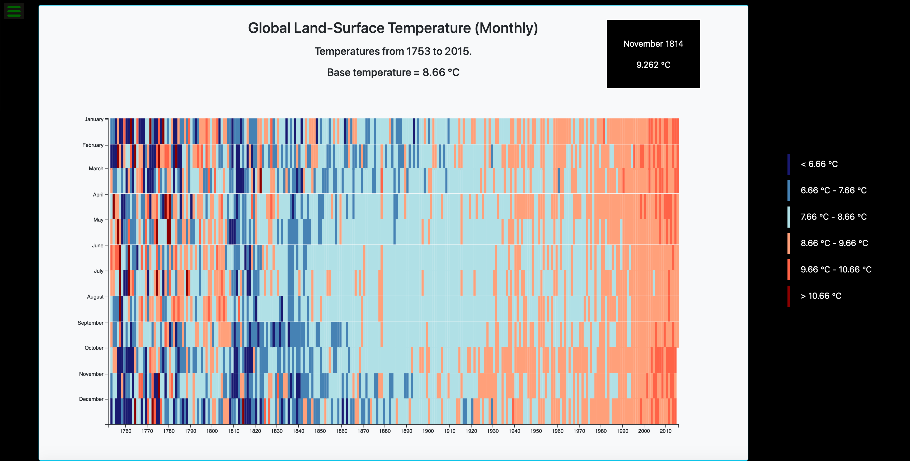

# D3 Heat Map

## Overview

A heat map built with D3.js.

## Description

This project incorporates many of the concepts I have learned with utilizing the D3.js library, but there were many new ideas that I learned as well. Setting up each axis was unique. I learned about the .ticks() method, which gave me the chance to add more ticks to the x axis and show years in increments of decades. I also learned even more about JavaScript date objects, since that was an essential part of creating the y axis in months. Another tricky aspect of this project was placing the data correctly where bars were stacked evenly according to their corresponding months and years. 

Overall, this was definitely a challenging project to create, but I feel like it has helped me gain a better grasp of the fundamentals of the D3.js library.

## Technologies Used

- HTML
- CSS
- Bootstrap
- JavaScript
- D3.js

## Installation

No installation steps are required to view this project. The application's source code can be found on GitHub here: https://github.com/vruss14/heat-map-d3.

## Usage

This webpage is best viewed on desktop devices. Below is a screenshot of the page:

## Credits

Valerie Russell was the sole contributor to this project. Contact her at vruss14@gmail.com.